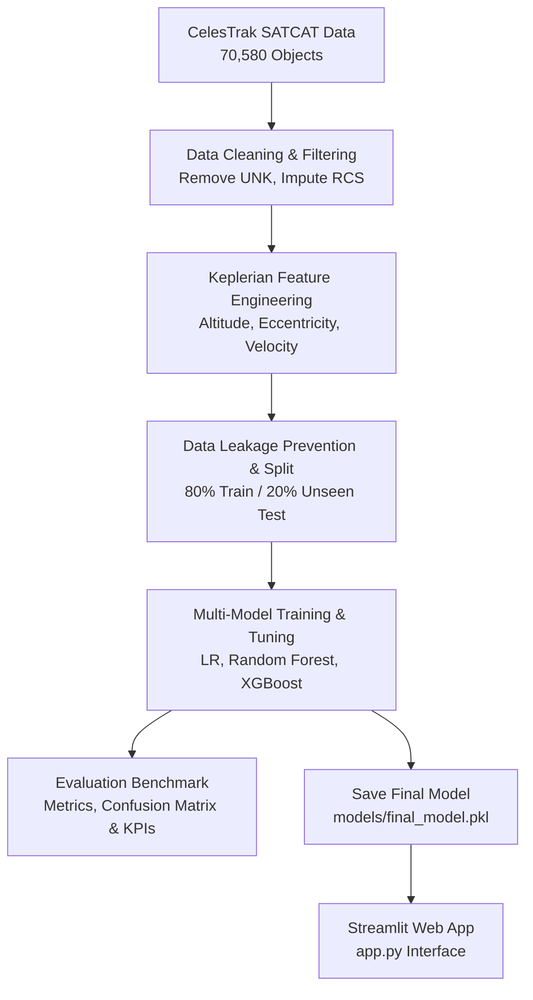

<div align="center">

# 🛰️ Space Debris & Orbital Object Classification
### *A Machine Learning Approach to Classifying Orbital Objects using NASA/ESA CelesTrak Data*

[](https://www.python.org/)
[](https://scikit-learn.org/)
[](https://xgboost.readthedocs.io/)
[](https://streamlit.io/)
[](https://celestrak.org/pub/satcat.csv)
[](https://opensource.org/licenses/MIT)

[Demo App](#-streamlit-prediction-interface) • [Key Features](#-key-features) • [Installation](#-installation--usage) • [Model Benchmarks](#-model-performance--benchmarks) • [Tech Stack](#-tech-stack)

</div>

---

## 📌 About The Project

Over **70,000 artificial objects** currently orbit Earth, over 60% of which consist of uncontrolled space debris fragments and upper-stage rocket bodies travelling at hypervelocities ($\approx 7.8\text{ km/s}$).

This repository provides a complete Machine Learning pipeline that processes real-world **CelesTrak Satellite Catalog (SATCAT)** tracking data to accurately classify cataloged space objects into two primary categories:
- **`Class 1` — Space Debris / Rocket Body** (Uncontrolled orbital objects)
- **`Class 0` — Payload Satellite** (Active or inactive spacecraft)

By engineering physical Keplerian orbital parameters (Mean Altitude, Eccentricity, Semi-Major Axis, Orbital Velocity) and size indicators (Radar Cross Section), the trained **Random Forest / XGBoost** models achieve **>92.3% Accuracy** and **>96.4% Recall** on unseen space tracking test data.

> [!NOTE]
> **Academic Scope**: This repository performs **Object-Type Classification** based on physical orbital features for academic research and demonstration. It is not an operational collision avoidance system.

---

## ✨ Key Features

- 🛰️ **Real Space Agency Dataset**: Built on 70,580 real cataloged space objects from CelesTrak (sourced from US Space Command / NORAD data).
- 🧹 **Robust Data Preprocessing**: Automated handling of missing orbital elements, median size imputation, and data leakage prevention.
- 📐 **Domain Feature Engineering**: Calculation of physical Keplerian parameters (Mean Altitude, Orbital Eccentricity, Semi-Major Axis, Velocity).
- 🤖 **Multi-Model Benchmark**: Comparative evaluation of **Logistic Regression**, **Random Forest**, and **XGBoost**.
- ⚡ **Ultra-Low Latency Inference**: Single-sample risk prediction executed in **< 5.7 ms** using saved model weights (`models/final_model.pkl`).
- 🖥️ **Interactive Web Interface**: Built-in **Streamlit** dashboard for testing custom orbital inputs and preset real-world space tracks.

---

## 🏗️ Architecture & Pipeline Flow



---

## 🖥️ Streamlit Prediction Interface

Launch the interactive dashboard to evaluate real-world orbital trajectories or enter custom orbital parameters:

```bash
py -m streamlit run app.py
```

### Dashboard Highlights:
- **Preset Trajectories**: Load actual tracks like *SL-1 Debris Fragment*, *Vanguard 1 Satellite*, or *GEO Inactive Satellite*.
- **Real-Time Feature Computation**: Auto-calculates Mean Altitude, Eccentricity, and Velocity as parameters are adjusted.
- **Probability Breakdown**: Renders confidence probability bar charts and reports single-sample inference latency.

---

## ⚡ Installation & Usage

### Prerequisites
- Python 3.10+
- Git

### 1. Clone Repository
```bash
git clone https://github.com/Ganeshraj-AI/SpaceDebris_And_Orbital_ObjectPrediction.git
cd SpaceDebris_And_Orbital_ObjectPrediction
```

### 2. Install Dependencies
```bash
pip install -r requirements.txt
```

### 3. Run Pipeline Scripts
```bash
# Step 1: Data Cleaning & Feature Engineering
python src/data_preprocessing.py

# Step 2: Model Training & Hyperparameter Tuning
python src/train.py

# Step 3: Model Evaluation Benchmark & KPI Calculation
python src/evaluate.py

# Step 4: Run Single-Sample Prediction Test
python src/predict.py
```

### 4. Run Interactive Web Dashboard
```bash
py -m streamlit run app.py
```

---

## 📊 Model Performance & Benchmarks

Evaluated on **13,673 unseen test objects**:

| Model | Accuracy | Precision | Recall (Debris Rate) | F1-Score | ROC-AUC | Prediction Latency |
|---|---:|---:|---:|---:|---:|---:|
| **Logistic Regression** | 73.59% | 73.25% | 88.50% | 80.16% | 0.7220 | **0.75 ms** |
| **Random Forest (Default)** | **92.91%** | **92.19%** | 96.40% | **94.25%** | **0.9794** | 43.89 ms |
| **XGBoost** | 92.36% | 91.62% | 96.13% | 93.82% | 0.9788 | **5.69 ms** |
| **Random Forest (Tuned)** | 92.34% | 91.34% | **96.43%** | 93.82% | 0.9776 | 43.43 ms |

### 🎯 Key Performance Indicators (KPIs):
- **Debris Hazard Recall**: **96.43%** (Target: $\ge 85.0\%$) — Minimizes dangerous False Negative misclassifications.
- **F1 Score**: **93.82%** (Target: $\ge 85.0\%$) — Balanced performance across both categories.
- **Data Completeness**: **88.16%** (Target: $\ge 80.0\%$) — High dataset completeness after cleaning.
- **Inference Latency**: **5.69 ms** (Target: $< 10.0\text{ ms}$) — Ultra-fast real-time inference using XGBoost.

---

## 📁 Repository Structure

```text
SpaceDebris_And_Orbital_ObjectPrediction/
│
├── data/
│   └── dataset.csv                 # Raw CelesTrak SATCAT Dataset (70,580 records)
│
├── src/
│   ├── data_preprocessing.py       # Data cleaning, feature engineering & leakage prevention
│   ├── train.py                    # Model training, hyperparameter tuning & saving
│   ├── evaluate.py                 # Evaluation metrics benchmark & KPI calculations
│   └── predict.py                  # Single-sample inference module
│
├── notebooks/
│   └── exploration.ipynb           # Comprehensive Exploratory Data Analysis (EDA) notebook
│
├── models/
│   └── final_model.pkl             # Serialized trained model artifact & scaler
│
├── app.py                          # Streamlit web application interface
├── requirements.txt                # Python package dependencies
└── README.md                       # Repository documentation
```

---

## 🛠️ Tech Stack

- **Core Language**: Python 3.10+
- **Data Analysis**: Pandas, NumPy
- **Machine Learning**: Scikit-Learn, XGBoost
- **Visualization**: Matplotlib, Seaborn
- **Dashboard UI**: Streamlit
- **Model Storage**: Joblib

---

## 📜 License & Acknowledgments

- **Dataset Credit**: Sourced from [CelesTrak](https://celestrak.org/) (Data derived from US Space Command / NORAD tracking catalog).
- **License**: MIT License — free for academic, research, and educational use.

<div align="center">
  <sub>Developed by <b>Ganeshraj-AI</b> • Built for ML Research & Space Data Analysis</sub>
</div>
